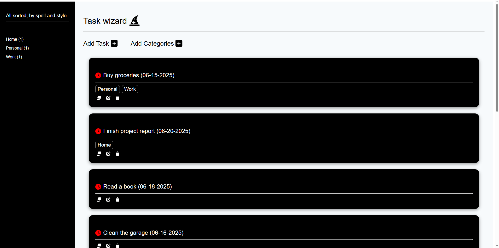
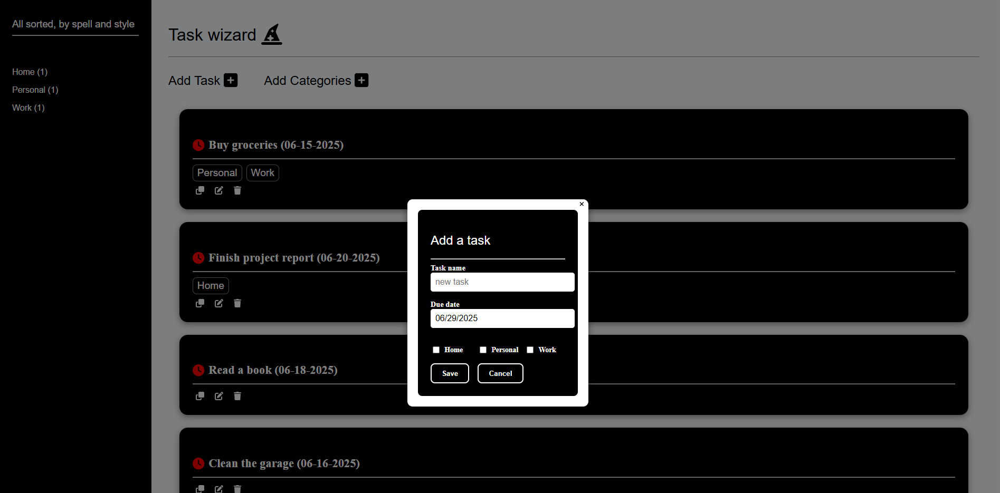
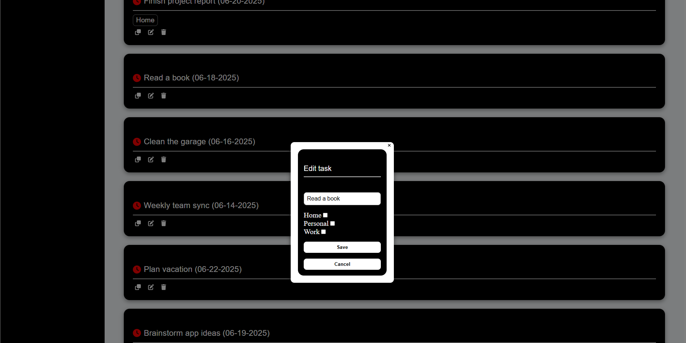
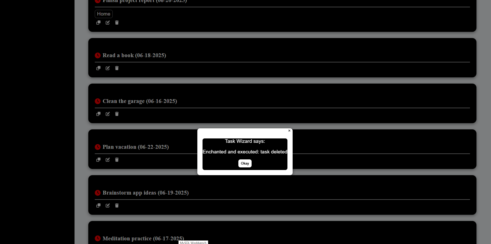
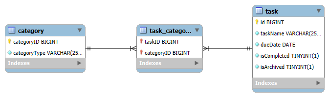
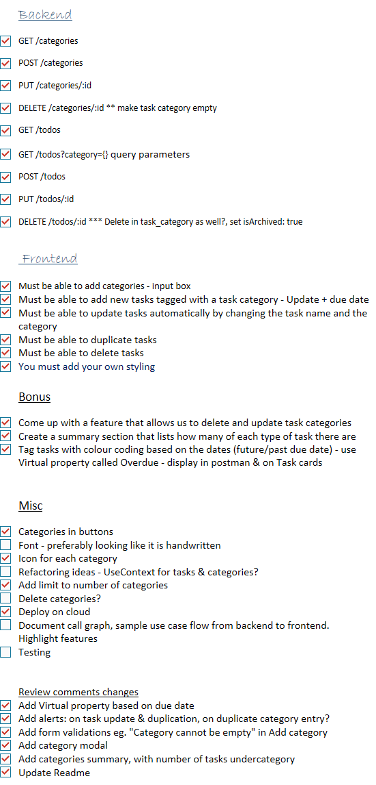

# ToDo Task Wizard

<ins>Github links</ins>
Frontend:
https://github.com/JaniTech2025/ToDoFrontend

Backend:
https://github.com/JaniTech2025/ToDoBackend

A full-stack ToDo task management application built with **Spring Java** and **MySql** backend and **React TypeScript** frontend.
A wizard themed task management App using which you can manage tasks, assign categories and keep your task list enchanted and clean.

## Features

- Create, update, delete, and duplicate tasks
- Assign categories to tasks
- Create new categories
- REST API based
- Responsive UI with interactive feedback
- Full-stack app: React TypeScript frontend + Spring Boot backend

### Frontend

## Tech Stack

## Screenshots

## Flow diagram

App.tsx
├── SideBar
├── TaskListPage
│ ├── TaskCards
│ │ ├── Duplicate, Edit & Delete (icons)
│ │ └── PickCategory (category checklist)
│ ├── CategoryListPage (popup modal)
│ └── AddTaskForm (popup modal)

### Backend

## Tech Stack

- Spring Java
- RESTful APIs
- MySQL

## Endpoints

- GET /categories
- POST /categories
- PUT /categories/:id
- DELETE /categories/:id \*\* make task category empty
- GET /todos
- GET /todos?category={} query parameters
- POST /todos
- PUT /todos/:id
- DELETE /todos/:id

## Checklist

## What I learnt

- If using lombok, setter and getter may interpret column names differently (isArchived as archived)-
  can lead to naming mismatches between backend and frontend
  Preferably use:
  @Column(name = "archived")
  private boolean archived;
- Good to organise a data mapping document with database column types and names
  and frontend App variable names, as a reference
- While dealing with an array of objects, check json response for data type from backend

## Future enhancements

- Add user profiles
- Add delete category functionality
- Sort tasks by categories, date
- In the summary section, when the category is clicked, take user to selected category section.
- Search tasks between dates
- Synchronise with calendar apps for notifications to user about an event
- Add a few more easter eggs
